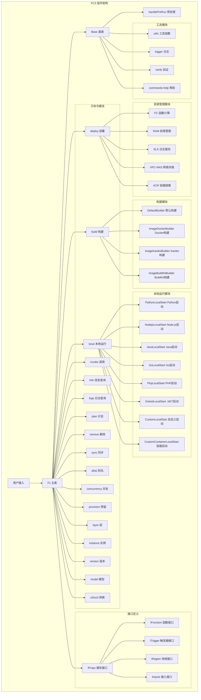

# FC3 组件架构文档

## 项目概述

FC3 是阿里云函数计算 3.0 的 Serverless Devs 组件，提供全生命周期的函数计算管理能力，包括创建、开发、调试、部署、运维等功能。

## 核心架构



## 目录结构

```
src/
├── commands-help/     # 配置 help 信息
├── default/           # 用于处理一些默认值
├── interface/         # 暴露一些全局的声明
├── resources/         # 对资源的公共处理
├── subCommands/       # 处理子命令的业务逻辑
├── utils/             # 公有方法
├── base.ts            # 命令公有处理方法和对外暴露的能力
├── constant.ts        # 一些常量，建议带有`__dirname`的寻址变量在此文件声明
├── index.ts           # 核心入口文件
└── logger.ts          # 处理日志的文件
```

## 核心模块详解

### 1. 主入口模块 (index.ts)

**功能**: FC3 组件的核心入口，提供所有子命令的统一接口

**主要方法**:

- `deploy()` - 部署函数
- `build()` - 构建函数
- `local()` - 本地运行
- `invoke()` - 调用函数
- `info()` - 查询信息
- `logs()` - 查询日志
- `plan()` - 执行计划
- `remove()` - 删除资源
- `sync()` - 同步配置
- `alias()` - 别名管理
- `concurrency()` - 并发配置
- `provision()` - 预留配置
- `layer()` - 层管理
- `instance()` - 实例管理
- `version()` - 版本管理
- `model()` - 模型管理
- `s2tos3()` - 配置转换

### 2. 基础模块 (base.ts)

**功能**: 提供所有子命令的公共处理逻辑

**核心方法**:

- `handlePreRun()` - 运行前预处理
  - 处理镜像配置
  - 处理角色权限
  - 设置基础目录
  - 应用默认配置
  - 处理 NAS 配置
  - 处理触发器角色

### 3. 子命令模块 (subCommands/)

#### 3.1 部署模块 (deploy/)

- **功能**: 函数和触发器的部署
- **核心文件**:
  - `index.ts` - 部署主逻辑
  - `impl/function.ts` - 函数部署实现
  - `impl/trigger.ts` - 触发器部署实现
  - `impl/vpc_binding.ts` - VPC 绑定
  - `impl/custom_domain.ts` - 自定义域名
  - `impl/concurrency_config.ts` - 并发配置
  - `impl/async_invoke_config.ts` - 异步调用配置
  - `impl/provision_config.ts` - 预留配置

#### 3.2 构建模块 (build/)

- **功能**: 多环境构建支持
- **构建器类型**:
  - `DefaultBuilder` - 默认构建器
  - `ImageDockerBuilder` - Docker 构建器
  - `ImageKanikoBuilder` - Kaniko 构建器
  - `ImageBuildKitBuilder` - BuildKit 构建器

#### 3.3 本地运行模块 (local/)

- **功能**: 多语言本地运行支持
- **支持语言**:
  - Python (`pythonLocalStart.ts`)
  - Node.js (`nodejsLocalStart.ts`)
  - Java (`javaLocalStart.ts`)
  - Go (`goLocalStart.ts`)
  - PHP (`phpLocalStart.ts`)
  - .NET (`dotnetLocalStart.ts`)
  - 自定义运行时 (`customLocalStart.ts`)
  - 自定义容器 (`customContainerLocalStart.ts`)

### 4. 资源管理模块 (resources/)

#### 4.1 FC 函数计算 (fc/)

- **功能**: 函数计算资源管理
- **核心文件**:
  - `index.ts` - FC 资源主入口
  - `impl/client.ts` - FC 客户端
  - `impl/utils.ts` - FC 工具函数
  - `impl/replace-function-config.ts` - 函数配置替换

#### 4.2 RAM 权限管理 (ram/)

- **功能**: 权限和角色管理
- **核心功能**:
  - 角色 ARN 格式验证
  - 角色 ARN 补全
  - 默认触发器角色创建

#### 4.3 SLS 日志服务 (sls/)

- **功能**: 日志服务集成
- **核心功能**:
  - 项目名称生成
  - 日志存储名称生成

#### 4.4 VPC-NAS 网络存储 (vpc-nas/)

- **功能**: VPC 和 NAS 配置管理
- **核心功能**:
  - VPC NAS 规则获取

#### 4.5 ACR 容器镜像 (acr/)

- **功能**: 容器镜像仓库管理
- **核心功能**:
  - ACR 注册表检测
  - VPC ACR 注册表检测
  - 镜像 URL 转换
  - Docker 配置生成

### 5. 工具模块 (utils/)

**核心工具函数**:

- `isAuto()` - 检查是否为自动配置
- `getTimeZone()` - 获取时区
- `removeNullValues()` - 移除空值
- `getFileSize()` - 获取文件大小
- `promptForConfirmOrDetails()` - 用户确认提示
- `checkDockerInstalled()` - 检查 Docker 安装
- `checkDockerDaemonRunning()` - 检查 Docker 守护进程
- `checkDockerIsOK()` - 检查 Docker 状态
- `isAppCenter()` - 检查是否在应用中心环境
- `isYunXiao()` - 检查是否在云效环境
- `tableShow()` - 表格显示
- `sleep()` - 延时函数
- `verify()` - 配置验证

### 6. 接口定义 (interface/)

**核心接口**:

- `IProps` - 组件属性接口
- `IFunction` - 函数接口
- `ITrigger` - 触发器接口
- `IRegion` - 地域接口
- `IInputs` - 输入接口
- `IAsyncInvokeConfig` - 异步调用配置接口
- `IConcurrencyConfig` - 并发配置接口
- `IProvisionConfig` - 预留配置接口

## 技术特点

### 1. 全生命周期管理

- 支持函数的创建、开发、调试、部署、运维全流程
- 提供完整的 CI/CD 集成能力

### 2. 多环境支持

- 支持多种构建环境（Docker、Kaniko、BuildKit）
- 支持多种运行环境（本地、云端）

### 3. 多语言支持

- 支持 Python、Node.js、Java、Go、PHP、.NET 等多种语言
- 支持自定义运行时和自定义容器

### 4. 安全发布

- 通过配置感知实现安全更新
- 支持角色权限管理

### 5. 可观测性

- 集成 SLS 日志服务
- 提供完善的日志查询功能

### 6. 多模调试

- 支持本地运行和在线运行
- 提供多种调试模式

## 配置管理

### 默认配置

- `FUNCTION_DEFAULT_CONFIG` - 函数默认配置
- `FUNCTION_CUSTOM_DEFAULT_CONFIG` - 自定义函数默认配置
- `IMAGE_ACCELERATION_REGION` - 镜像加速地域配置

### 配置验证

- 使用 JSON Schema 进行配置验证
- 支持运行时配置检查

## 错误处理

### 错误类型

- 配置错误
- 权限错误
- 网络错误
- 资源错误

### 错误处理策略

- 提供具体的错误信息
- 支持错误重试机制
- 记录详细的错误日志

## 性能优化

### 并行处理

- 支持并行部署多个资源
- 优化网络请求性能

### 缓存机制

- 配置缓存
- 资源状态缓存

## 扩展性

### 插件机制

- 支持自定义构建器
- 支持自定义触发器
- 支持自定义运行时

### 配置扩展

- 支持自定义配置项
- 支持环境变量配置
- 支持配置文件继承
