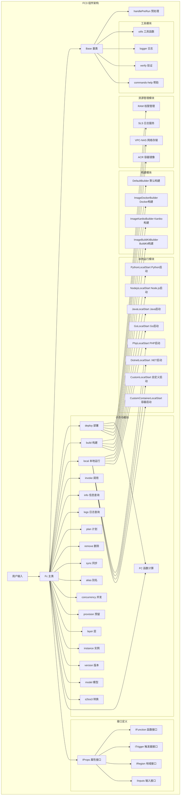

# FC3 组件架构文档

## 项目概述

FC3 是阿里云函数计算 3.0 的 Serverless Devs 组件，提供全生命周期的函数计算管理能力，包括创建、开发、调试、部署、运维等功能。

## 核心架构


```mermaid
graph TB
    subgraph "FC3 组件架构"
        A[用户输入] --> B[Fc 主类]
        B --> C[Base 基类]
        C --> D[handlePreRun 预处理]

        subgraph "子命令模块"
            E[deploy 部署]
            F[build 构建]
            G[local 本地运行]
            H[invoke 调用]
            I[info 信息查询]
            J[logs 日志查询]
            K[plan 计划]
            L[remove 删除]
            M[sync 同步]
            N[alias 别名]
            O[concurrency 并发]
            P[provision 预留]
            Q[layer 层]
            R[instance 实例]
            S[version 版本]
            T[model 模型]
            U[s2tos3 转换]
            V[skill 技能安装]
        end

        B --> E
        B --> F
        B --> G
        B --> H
        B --> I
        B --> J
        B --> K
        B --> L
        B --> M
        B --> N
        B --> O
        B --> P
        B --> Q
        B --> R
        B --> S
        B --> T
        B --> U
        B --> V

        subgraph "资源管理模块"
            V[FC 函数计算]
            W[RAM 权限管理]
            X[SLS 日志服务]
            Y[VPC-NAS 网络存储]
            Z[ACR 容器镜像]
        end

        E --> V
        E --> W
        E --> X
        E --> Y
        E --> Z

        subgraph "构建模块"
            AA[DefaultBuilder 默认构建]
            BB[ImageDockerBuilder Docker构建]
            CC[ImageKanikoBuilder Kaniko构建]
            DD[ImageBuildKitBuilder BuildKit构建]
        end

        F --> AA
        F --> BB
        F --> CC
        F --> DD

        subgraph "本地运行模块"
            EE[PythonLocalStart Python启动]
            FF[NodejsLocalStart Node.js启动]
            GG[JavaLocalStart Java启动]
            HH[GoLocalStart Go启动]
            II[PhpLocalStart PHP启动]
            JJ[DotnetLocalStart .NET启动]
            KK[CustomLocalStart 自定义启动]
            LL[CustomContainerLocalStart 容器启动]
        end

        G --> EE
        G --> FF
        G --> GG
        G --> HH
        G --> II
        G --> JJ
        G --> KK
        G --> LL

        subgraph "工具模块"
            MM[utils 工具函数]
            NN[logger 日志]
            OO[verify 验证]
            PP[commands-help 帮助]
        end

        C --> MM
        C --> NN
        C --> OO
        C --> PP

        subgraph "接口定义"
            QQ[IProps 属性接口]
            RR[IFunction 函数接口]
            SS[ITrigger 触发器接口]
            TT[IRegion 地域接口]
            UU[IInputs 输入接口]
        end

        B --> QQ
        QQ --> RR
        QQ --> SS
        QQ --> TT
        QQ --> UU
    end
```

## 目录结构

```
src/
├── commands-help/     # 配置 help 信息
├── default/           # 用于处理一些默认值
├── interface/         # 暴露一些全局的声明
├── resources/         # 对资源的公共处理
├── subCommands/       # 处理子命令的业务逻辑
├── utils/             # 公有方法
├── base.ts            # 命令公有处理方法和对外暴露的能力
├── constant.ts        # 一些常量，建议带有`__dirname`的寻址变量在此文件声明
├── index.ts           # 核心入口文件
└── logger.ts          # 处理日志的文件
```

## 核心模块详解

### 1. 主入口模块 (index.ts)

**功能**: FC3 组件的核心入口，提供所有子命令的统一接口

**主要方法**:

- `deploy()` - 部署函数
- `build()` - 构建函数
- `local()` - 本地运行
- `invoke()` - 调用函数
- `info()` - 查询信息
- `logs()` - 查询日志
- `plan()` - 执行计划
- `remove()` - 删除资源
- `sync()` - 同步配置
- `alias()` - 别名管理
- `concurrency()` - 并发配置
- `provision()` - 预留配置
- `layer()` - 层管理
- `instance()` - 实例管理
- `version()` - 版本管理
- `model()` - 模型管理
- `s2tos3()` - 配置转换
- `skill()` - 安装/更新 `s-fc3` skill 到主流 Agent 工具（本地操作，无需凭证，不走 `handlePreRun`）

### 2. 基础模块 (base.ts)

**功能**: 提供所有子命令的公共处理逻辑

**核心方法**:

- `handlePreRun()` - 运行前预处理
  - 处理镜像配置
  - 处理角色权限
  - 设置基础目录
  - 应用默认配置
  - 处理 NAS 配置
  - 处理触发器角色

### 3. 子命令模块 (subCommands/)

#### 3.1 部署模块 (deploy/)

- **功能**: 函数和触发器的部署
- **核心文件**:
  - `index.ts` - 部署主逻辑
  - `impl/function.ts` - 函数部署实现
  - `impl/trigger.ts` - 触发器部署实现
  - `impl/vpc_binding.ts` - VPC 绑定
  - `impl/custom_domain.ts` - 自定义域名
  - `impl/concurrency_config.ts` - 并发配置
  - `impl/async_invoke_config.ts` - 异步调用配置
  - `impl/provision_config.ts` - 预留配置

#### 3.2 构建模块 (build/)

- **功能**: 多环境构建支持
- **构建器类型**:
  - `DefaultBuilder` - 默认构建器
  - `ImageDockerBuilder` - Docker 构建器
  - `ImageKanikoBuilder` - Kaniko 构建器
  - `ImageBuildKitBuilder` - BuildKit 构建器

#### 3.3 本地运行模块 (local/)

- **功能**: 多语言本地运行支持
- **支持语言**:
  - Python (`pythonLocalStart.ts`)
  - Node.js (`nodejsLocalStart.ts`)
  - Java (`javaLocalStart.ts`)
  - Go (`goLocalStart.ts`)
  - PHP (`phpLocalStart.ts`)
  - .NET (`dotnetLocalStart.ts`)
  - 自定义运行时 (`customLocalStart.ts`)
  - 自定义容器 (`customContainerLocalStart.ts`)

#### 3.4 技能安装模块 (skill/)

- **功能**: 把随组件打包的 `s-fc3` skill 安装/更新到主流 Agent 工具目录，纯本地操作，无需云凭证
- **核心文件**:
  - `constants.ts` - 工具 → 目录映射（`claude/codex/cursor/qoder/agents`，统一约定 `<工具目录>/skills/s-fc3/`）
  - `installer.ts` - skill 源解析（`dist/skills` → 仓库 `.agents` → cwd `.agents`）与拷贝逻辑（纯函数，易测）
  - `index.ts` - 参数解析（`--tools`、`--global`、`--project`、`--force`）与 `install`/`update` 派发
- **语义**: `install` 遇到已存在目标跳过（除非 `--force`）；`update` 始终覆盖
- **打包**: skill 源文件在 `.agents/skills/s-fc3`，由 `prebuild`/`prewatch` 脚本拷贝进 `dist/skills/s-fc3`，随 npm 包发布

### 4. 资源管理模块 (resources/)

#### 4.1 FC 函数计算 (fc/)

- **功能**: 函数计算资源管理
- **核心文件**:
  - `index.ts` - FC 资源主入口
  - `impl/client.ts` - FC 客户端
  - `impl/utils.ts` - FC 工具函数
  - `impl/replace-function-config.ts` - 函数配置替换

#### 4.2 RAM 权限管理 (ram/)

- **功能**: 权限和角色管理
- **核心功能**:
  - 角色 ARN 格式验证
  - 角色 ARN 补全
  - 默认触发器角色创建

#### 4.3 SLS 日志服务 (sls/)

- **功能**: 日志服务集成
- **核心功能**:
  - 项目名称生成
  - 日志存储名称生成
  - SLS 查询语句生成（支持字段查询语法）
  - 多 topic 搜索（FCLogs、FCInstanceEvents）

#### 4.4 VPC-NAS 网络存储 (vpc-nas/)

- **功能**: VPC 和 NAS 配置管理
- **核心功能**:
  - VPC NAS 规则获取

#### 4.5 ACR 容器镜像 (acr/)

- **功能**: 容器镜像仓库管理
- **核心功能**:
  - ACR 注册表检测
  - VPC ACR 注册表检测
  - 镜像 URL 转换
  - Docker 配置生成

### 5. 工具模块 (utils/)

**核心工具函数**:

- `isAuto()` - 检查是否为自动配置
- `getTempDir()` - 获取临时目录（realpath 解析，供 Docker 挂载）
- `getLocalIpAddress()` - 获取本机首个非 loopback IPv4
- `removeNullValues()` - 移除空值
- `getFileSize()` - 获取文件大小
- `promptForConfirmOrDetails()` - 用户确认提示
- `checkDockerInstalled()` - 检查 Docker 安装
- `checkDockerDaemonRunning()` - 检查 Docker 守护进程
- `checkDockerIsOK()` - 检查 Docker 状态
- `isAppCenter()` - 检查是否在应用中心环境
- `isYunXiao()` - 检查是否在云效环境
- `tableShow()` - 表格显示
- `sleep()` - 延时函数
- `verify()` - 配置验证

### 6. 接口定义 (interface/)

**核心接口**:

- `IProps` - 组件属性接口
- `IFunction` - 函数接口
- `ITrigger` - 触发器接口
- `IRegion` - 地域接口
- `IInputs` - 输入接口
- `IAsyncInvokeConfig` - 异步调用配置接口
- `IConcurrencyConfig` - 并发配置接口
- `IProvisionConfig` - 预留配置接口

## 部署流程

`deploy` 是最复杂的命令，串联了大多数资源模块，流程如下：

1. `base.ts` 的 `handlePreRun` 预处理输入：补全镜像、角色、NAS 配置，套用默认值。
2. `deploy/impl/function.ts` 拉取线上函数配置，与本地做 diff（`_plan`），无差异则跳过，有差异则交互确认。
3. 处理 `auto` 资源（`_deployAuto`）：按需创建 SLS 日志、OSS 挂载、RAM 角色、VPC/NAS，并回填到函数配置。
4. 处理代码：非容器运行时压缩上传代码包（校验 CRC64，未变更则跳过）；容器运行时推送镜像到 ACR。
5. 调用 FC SDK 完成函数、触发器、域名、并发、预留等配置的部署。

## 配置验证

组件用 `src/schema.json`（由 `npm run generate-schema` 从 `interface/` 生成）对 `IProps` 做 JSON Schema 校验，`utils/verify` 在运行前检查配置。

## 已知设计说明

- **model / fileManager 重复**：`subCommands/model/index.ts`（`ModelService`）与 `fileManager.ts`（`ArtModelService`）实现相近，按 `modelConfig.solution` 分支选择。两者逻辑存在差异，尚未合并——合并前需补齐覆盖两个分支的测试，属于风险改动。
- **依赖重叠**：项目同时依赖 FC2 与 FC3 SDK、以及多套 OSS/归档库，均有实际引用（详见 `npm run depcheck` 报告），不可直接移除。
